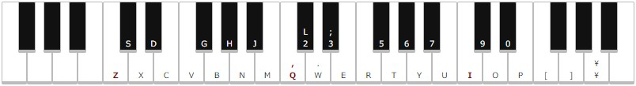

# weB-music
ブラウザで動作するシンセ的な何かを作りたかった

Web Audio API で波形を作り，再生する．
基準周波数A4は440Hz，他の音は $440 \times 2^{\frac{x}{12}}$ で計算している（平均律）．
エンベロープの調節では指数関数的に音量が変化し，指定した時間でおおよそ63.2%になる．（指定した時間*2で86.5%，*3で95.0%，*5で99.3%）  
<!-- Customでは（正規化された）波形 $\tilde{x}(n) = \sum^{L-1}_{k=1}(a[k]\cos\frac{2\pi kn}{N} + b[k]\sin\frac{2\pi kn}{N})$ により音を作る機能です．このときの $a$（Real）, $b$（Imag）がスライダーで調節できる係数となっています．   -->

-----

デモ Preset1 (音が出ます)

<video controls src="https://github.com/Fukuda-B/weB-music/assets/60131202/6c315e79-6269-4be4-8c5e-2db05869498c" muted="false"></video>

デモ2 Preset3 (音が出ます)

<video controls src="https://github.com/Fukuda-B/weB-music/assets/60131202/f3f13bfd-5b55-4b16-ad59-bf149e5c495f" muted="false"></video>

演奏にはまだ練習が必要..
